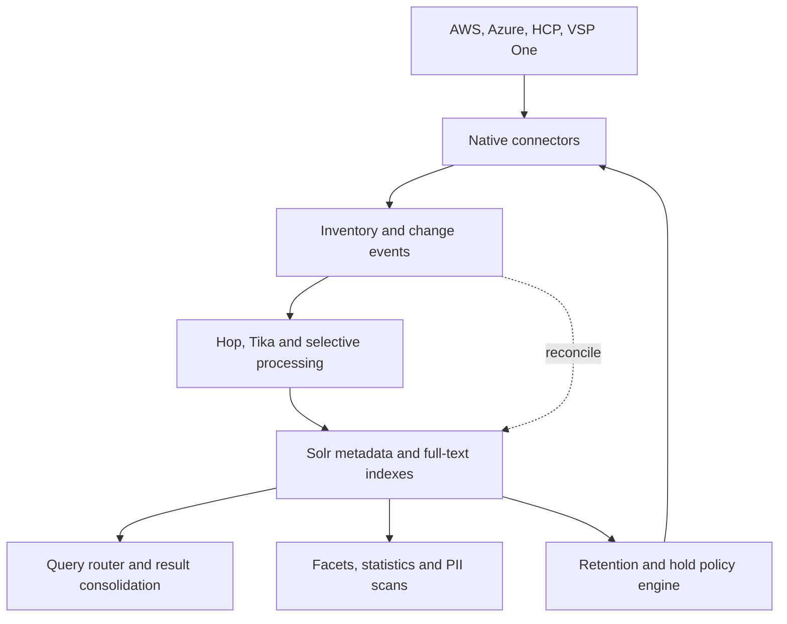

# Architecture

## System context

## Connector contract

Each connector exposes capabilities rather than pretending every backend is identical:

- authoritative inventory or bounded listing;
- object/version read and HEAD;
- native metadata, tags and annotations;
- incremental events or change journal;
- retention, hold and lock state;
- permitted retention/hold mutations;
- backend verification after a mutation.

## Index contract

Every indexed record carries stable source identity, native version/generation, content hash when available, connector, account, container, object key, pipeline version and indexing status. Metadata and full text may be stored in separate collections, joined logically by stable object identity.

## Search contract

The schema catalogue records field names, types, aliases, security rules and target indexes. The router resolves user mappings, sends only valid subqueries, normalizes scores and fields, deduplicates by source identity, and returns a consolidated result with per-index diagnostics.

## Governance contract

Solr finds candidates. AMP verifies the current source object and native governance state before applying a retention or hold action. All policies support dry-run, approval, idempotent action keys, backend verification and immutable audit evidence.

## PII boundary

Customer regex rules are versioned, field-scoped and executed with limits. A match records the rule, field, evidence location and object identity without copying sensitive values into logs. Regex matching is a configurable detector, not a guarantee that all PII has been found.
