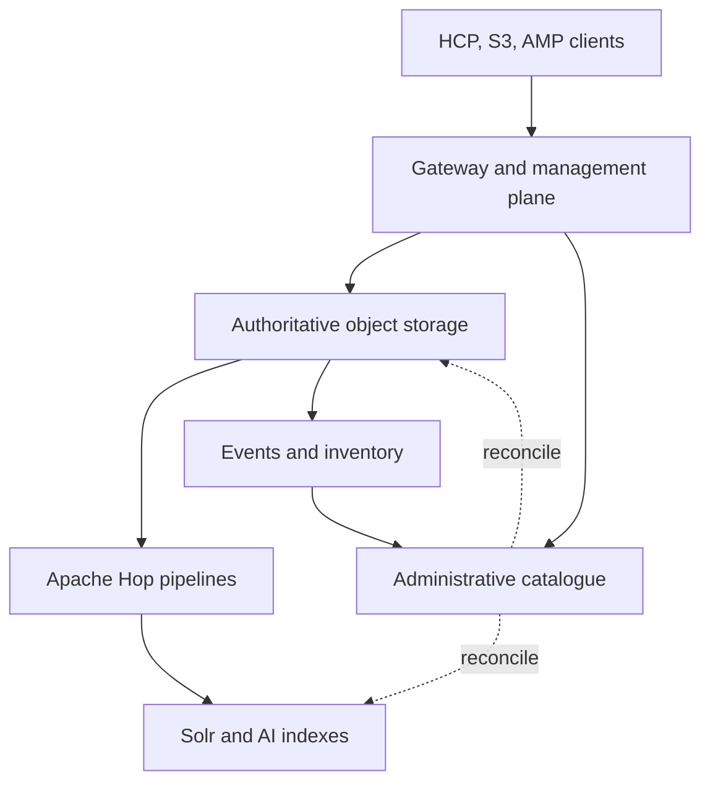

# Architecture

This is the canonical architecture summary. Detailed Beta 5 references remain under `docs/reference/`.

## System context



## Catalogue boundary and identity

`Storage System + Namespace/Bucket/Container = Catalogue Group`.

Each group has an independent lifecycle, generation history, job scope, reconciliation scope, stable `recon_namespace`, and 1024 stable virtual shards. Logical object IDs are deterministic UUIDv5 values derived from the catalogue namespace and logical key. A migrated target obtains its own target-local ID; lineage connects source and target.

## Managed package

AMP package V3 keeps the client key logical and stores a stable package containing:

```text
<GUID>/
  payload
  manifest.json
  annotations/
```

Placement can use AMP-managed hash fan-out or client-path placement. Rewrites reuse the same backend keys; backend-native versioning creates history when enabled.

## Read and migration behavior

Routes independently choose primary-only, read-through, or read-through-hydrate behavior. Hydration reads the legacy/source object, writes the target package, verifies the write, and only then registers the target catalogue record and lineage.

## Response behavior

Each route selects `RAW_BACKEND`, `AMP_NORMALIZED`, or `AMP_NORMALIZED_WITH_BACKEND`, plus `NONE`, `SELECTED`, or `ALL_SAFE` backend-header exposure. Backend HTTP outcome remains authoritative.

## Detailed references

- [Beta 5 architecture](reference/ARCHITECTURE.md)
- [Backend authority](reference/BACKEND_AUTHORITY.md)
- [Catalogue sharding](reference/CATALOGUE_SHARDING.md)
- [Change capture](reference/CHANGE_CAPTURE.md)
- [Gateway response policy](reference/GATEWAY_RESPONSE_POLICY.md)
- [Security](reference/SECURITY.md)

